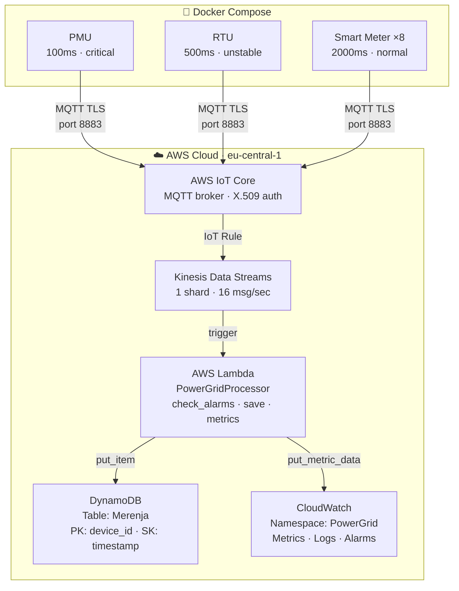
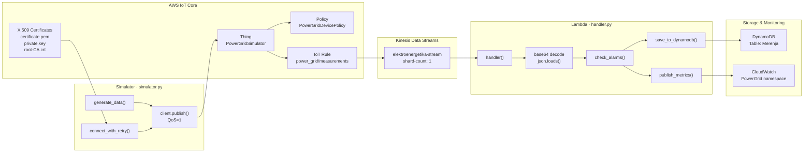
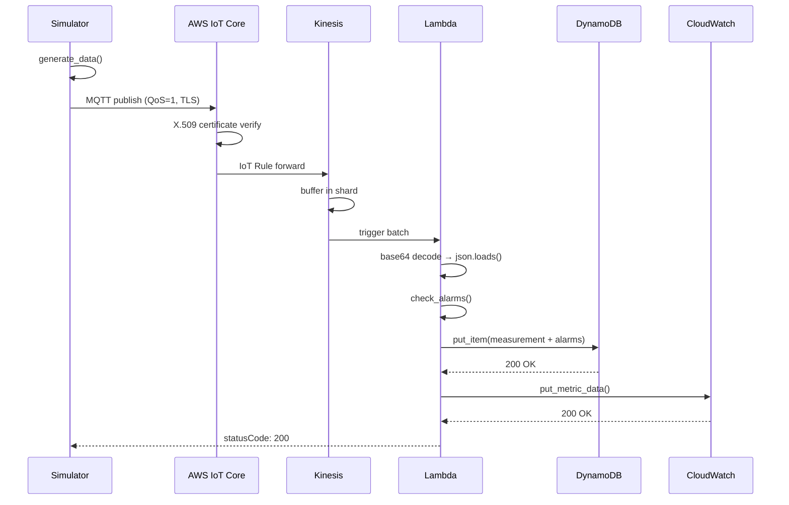
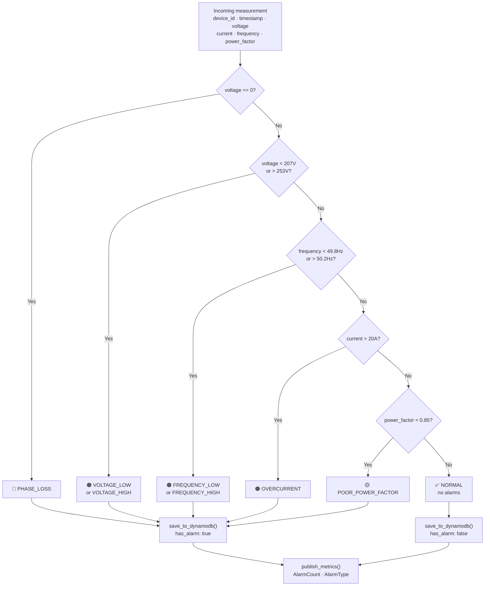

# Architecture Diagrams

## 1. Data Flow Diagram

```mermaid
flowchart TD
    subgraph Docker["🐳 Docker Compose"]
        PMU["PMU\n100ms · critical"]
        RTU["RTU\n500ms · unstable"]
        SM["Smart Meter ×8\n2000ms · normal"]
    end

    subgraph AWS["☁️ AWS Cloud · eu-central-1"]
        IOT["AWS IoT Core\nMQTT broker · X.509 auth"]
        KINESIS["Kinesis Data Streams\n1 shard · 16 msg/sec"]
        LAMBDA["AWS Lambda\nPowerGridProcessor\ncheck_alarms · save · metrics"]
        DYNAMO["DynamoDB\nTable: Merenja\nPK: device_id · SK: timestamp"]
        CW["CloudWatch\nNamespace: PowerGrid\nMetrics · Logs · Alarms"]
    end

    PMU -->|"MQTT TLS\nport 8883"| IOT
    RTU -->|"MQTT TLS\nport 8883"| IOT
    SM -->|"MQTT TLS\nport 8883"| IOT

    IOT -->|"IoT Rule"| KINESIS
    KINESIS -->|"trigger"| LAMBDA
    LAMBDA -->|"put_item"| DYNAMO
    LAMBDA -->|"put_metric_data"| CW
```

---

## 2. Component Diagram

```mermaid
graph LR
    subgraph Simulator["Simulator · simulator.py"]
        GD["generate_data()"]
        CA_SIM["connect_with_retry()"]
        PUB["client.publish()\nQoS=1"]
    end

    subgraph IoTCore["AWS IoT Core"]
        THING["Thing\nPowerGridSimulator"]
        POLICY["Policy\nPowerGridDevicePolicy"]
        RULE["IoT Rule\npower_grid/measurements"]
        CERTS["X.509 Certificates\ncertificate.pem\nprivate.key\nroot-CA.crt"]
    end

    subgraph KinesisComp["Kinesis Data Streams"]
        STREAM["elektroenergetika-stream\nshard-count: 1"]
    end

    subgraph LambdaComp["Lambda · handler.py"]
        HANDLER["handler()"]
        DECODE["base64 decode\njson.loads()"]
        CHECK["check_alarms()"]
        SAVE["save_to_dynamodb()"]
        METRICS["publish_metrics()"]
    end

    subgraph Storage["Storage & Monitoring"]
        DB["DynamoDB\nTable: Merenja"]
        WATCH["CloudWatch\nPowerGrid namespace"]
    end

    GD --> PUB
    CA_SIM --> PUB
    CERTS --> CA_SIM
    PUB --> THING
    THING --> POLICY
    THING --> RULE
    RULE --> STREAM
    STREAM --> HANDLER
    HANDLER --> DECODE
    DECODE --> CHECK
    CHECK --> SAVE
    CHECK --> METRICS
    SAVE --> DB
    METRICS --> WATCH
```

---

## 3. Sequence Diagram

```mermaid
sequenceDiagram
    participant S as Simulator
    participant IoT as AWS IoT Core
    participant K as Kinesis
    participant L as Lambda
    participant D as DynamoDB
    participant CW as CloudWatch

    S->>S: generate_data()
    S->>IoT: MQTT publish (QoS=1, TLS)
    IoT->>IoT: X.509 certificate verify
    IoT->>K: IoT Rule forward
    K->>K: buffer in shard
    K->>L: trigger batch
    L->>L: base64 decode → json.loads()
    L->>L: check_alarms()
    L->>D: put_item(measurement + alarms)
    D-->>L: 200 OK
    L->>CW: put_metric_data()
    CW-->>L: 200 OK
    L-->>S: statusCode: 200
```

---

## 4. Alarm Detection Flow

```mermaid
flowchart TD
    MSG["Incoming measurement\ndevice_id · timestamp · voltage\ncurrent · frequency · power_factor"]
    
    MSG --> V{"voltage == 0?"}
    V -->|Yes| PL["🔴 PHASE_LOSS"]
    V -->|No| V2{"voltage < 207V\nor > 253V?"}
    V2 -->|Yes| VL["🟠 VOLTAGE_LOW\nor VOLTAGE_HIGH"]
    V2 -->|No| F{"frequency < 49.8Hz\nor > 50.2Hz?"}
    
    F -->|Yes| FL["🟠 FREQUENCY_LOW\nor FREQUENCY_HIGH"]
    F -->|No| C{"current > 20A?"}
    
    C -->|Yes| OC["🟠 OVERCURRENT"]
    C -->|No| PF{"power_factor < 0.85?"}
    
    PF -->|Yes| PPF["🟡 POOR_POWER_FACTOR"]
    PF -->|No| OK["✅ NORMAL\nno alarms"]

    PL --> SAVE["save_to_dynamodb()\nhas_alarm: true"]
    VL --> SAVE
    FL --> SAVE
    OC --> SAVE
    PPF --> SAVE
    OK --> SAVE2["save_to_dynamodb()\nhas_alarm: false"]

    SAVE --> CW["publish_metrics()\nAlarmCount · AlarmType"]
    SAVE2 --> CW
```
